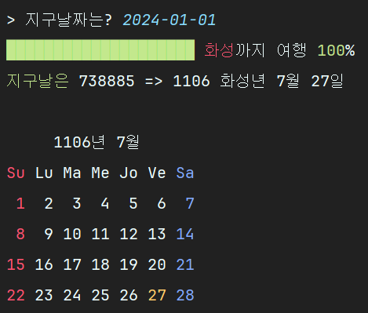

# 화성 달력 시계
## 설계과정
- 지구력을 화성력으로 변환하기
1. java.time.LocalDate와 java.time.temporal.ChronoUnit을 사용하여 입력받은 지구력이 며칠째인지를 알아낸다.  
2. 그 날짜를 화성력으로 변환한다.
3. 화성력으로 변환한 화성월의 달력을 출력한다.
- 진행상황 바 만들기
1. "\r" 캐리지 리턴 사용해서 줄 업데이트 하기
2. 비동기 api 이용해서 연산하는 동안에도 계속 진행상황 바 업데이트하기

DayConverter 클래스와 Progress 클래스를 만들어서 각각 위의 역할을 주고, 두 클래스 모드 스레드를 상속시켜서 스레드 두개가 각자 실행되도록 함.  

## 구현 메서드
- 지구력을 화성력으로 변환하기는 DayConverter 클래스에 구현하였다.
- 위의 설계과정을 각각 메서드로 구현
1. public int findDaysByEarthDate(LocalDate earthDate)  
ChronoUnit을 이용하여 쉽게 구할 수 있었다.
2. public int[] findMarsDateByDays(int days)  
윤년이 2년마다 나오므로 2년씩 묶어서 연도를 계산하였다.  
그리고는 월은 24개 뿐이니 24번 순회하면서 각 월의 날짜 수만큼 빼줌.  
남은 날짜들은 전부 일 에 더해줌.  
3. public String printConvertedCalender(String date)
화성력으로 변환한 연월일을 받아 양식에 맞게 화성력 달력을 출력함.  
ANSI 코드를 사용하여 실제 달력처럼 휴일에는 색칠하고, 현재 날짜에도 색칠함.  
DayConverter 클래스도 Thread를 상속받아서 스레드로 만들었으므로, run 메서드를 오버라이딩하여 스레드로 동작하도록 함.  
run 메서드를 실행한 후 결과는 result 멤버 변수에 저장하고, 추후 getResult를 하여 출력하도록 함.  

- 진행상황 바 만들기는 Progress 클래스에 구현하였다.
1. public void printProgress(int progress)  
```java
for(int i = 0 ; i <=10;i++){
    try {
        System.out.print("\r"+progressPercentage(i)+"   ");
        System.out.flush();
        Thread.sleep(500);
    } catch (InterruptedException e) {
        throw new RuntimeException(e);
    }
}
```
위와 같이 "\r"을 사용하여 캐리지 리턴을 하여 줄을 업데이트하고, flush를 사용하여 버퍼를 비워서 바로 출력하도록 함.
2. Progress도 역시 스레드를 상속하고, run 메서드를 오버라이딩하여 스레드로 동작하도록 함.  

## 실행 방법
```java
        System.out.print("> 지구날짜는? ");
        String input = sc.nextLine();
        
        DayConverter dayConverter = new DayConverter(input);
        Progress progress = new Progress();

        dayConverter.start();
        progress.start();

        progress.join();
        dayConverter.join();

        System.out.println(dayConverter.getResult());
```
input을 받아 DayConverter 클래스에 생성자로 전달하고, DayConverter과 Progress에 start 메서드를 호출하여 스레드를 실행시킨다.  
join을 통해 두 스레드가 모두 완료된 이후에 결과를 출력하도록 함.

## 실수 
CompletableFuture를 사용하는 법을 잘 모르고, 스레드도 잘 몰라서 처음에는 하나에만 ComputableFuture를 사용했다.  
그렇게 하니 비동기적으로 실행이 안돼서 책으로 스레드에 대해서 다시 배우고, 두 개의 스레드를 생성했다. 

## 실행 결과 
```
> 지구날짜는? 2024-01-01
████████████████████ 화성까지 여행 100%   
지구날은 738885 => 1106 화성년 7월 27일

     1106년 7월
Su Lu Ma Me Jo Ve Sa
 1  2  3  4  5  6  7 
 8  9 10 11 12 13 14 
15 16 17 18 19 20 21 
22 23 24 25 26 27 28 
```

